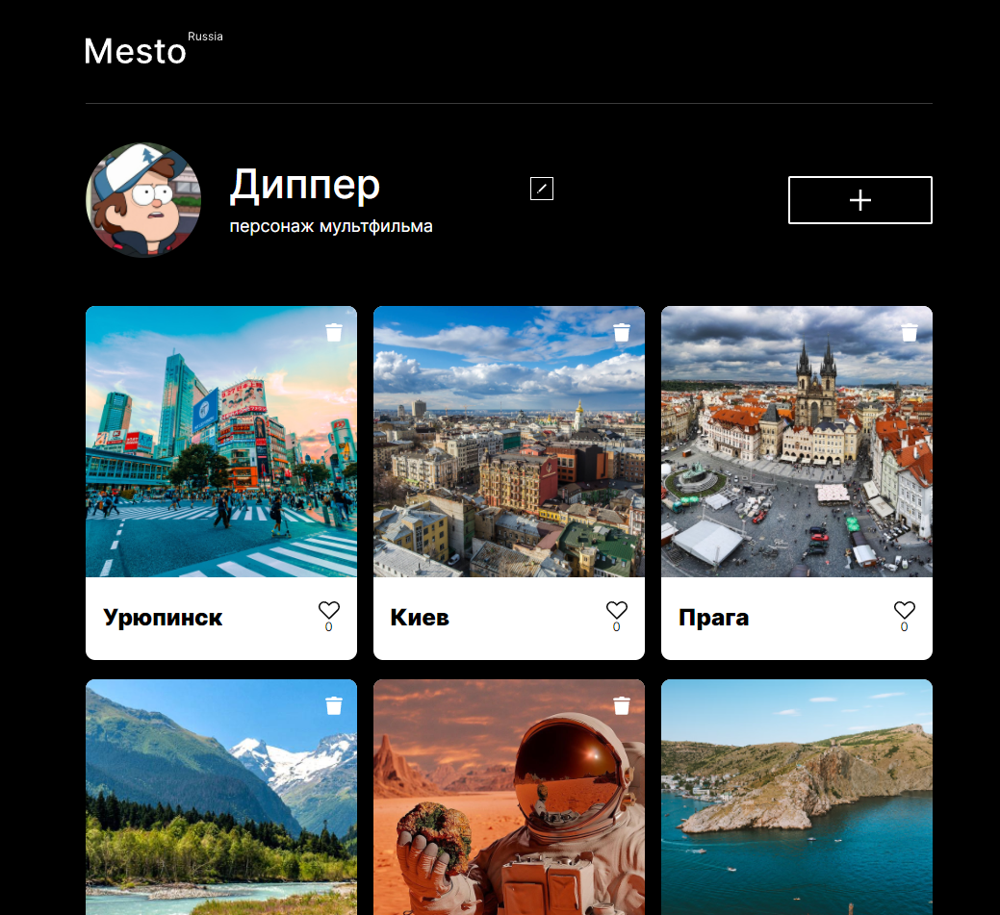

# react-mesto-api-full
Репозиторий для приложения проекта `Mesto`, включающий фронтенд и бэкенд части приложения со следующими возможностями: авторизации и регистрации пользователей, операции с карточками и пользователями. Бэкенд расположите в директории `backend/`, а фронтенд - в `frontend/`. 
##  BACK-END
`/routes` — папка с файлами роутера  
`/controllers` — папка с файлами контроллеров пользователя и карточки   
`/models` — папка с файлами описания схем пользователя и карточки

* Реализовано логирование запросов и ошибок
    * каждый запрос к API и ошибки, возникшие во время запроса, сохраняться в файле request.log.
* Создан облачный сервер в Яндекс.Облако, развернут API
* Создан на сервере .env-файл
    * NODE_ENV=production,
    * JWT_SECRET с секретным ключом для создания и верификации JWT.
* Выпущен и подключён SSL-сертификат
* Запущен pm2
  
### Запуск проекта

`npm run start` — запускает сервер   
`npm run dev` — запускает сервер с hot-reload

##  FRONT-END

* Реализован функциональный подход
* Регистрация и авторизация
* Редактирование профиля
* Добавление/удаление карточки
* Постановка и снятие лайка

  
<!--- https://mesto-testo.nomoredomains.rocks

https://api.mesto-testo.nomoredomains.rocks

217.28.228.138 ---!>

